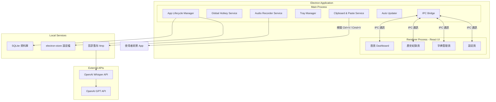
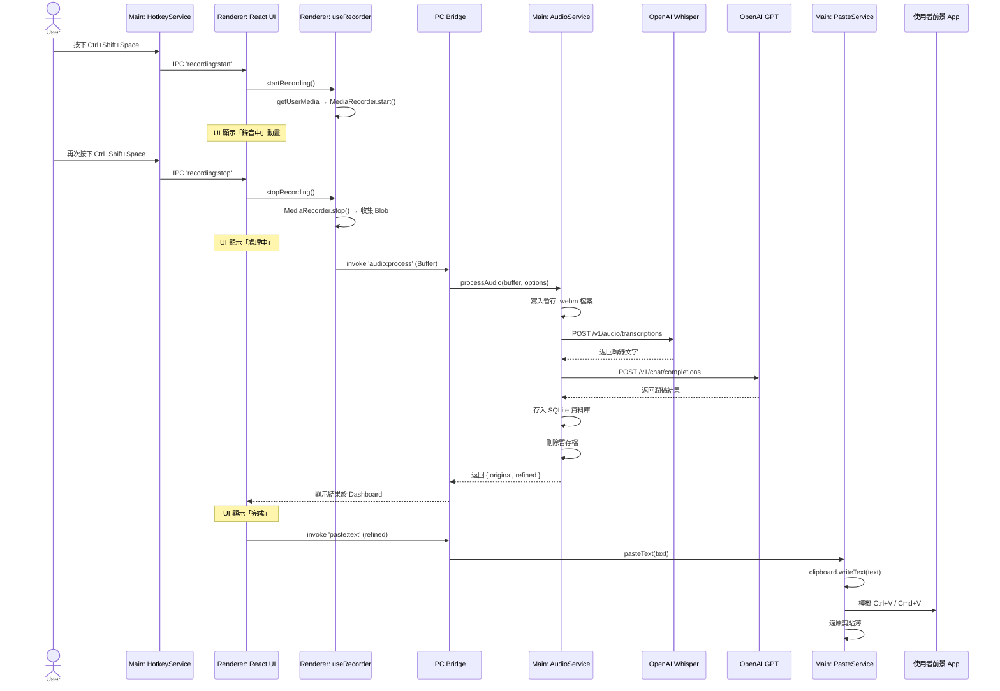

# 跨平台 AI 語音輸入助手 — 軟體設計文件 (SDD)

> **專案代號**：VoiceFlow  
> **版本**：v1.0 Draft  
> **日期**：2026-02-25  
> **技術棧**：Electron + React + TypeScript + Node.js  
> **目標平台**：Windows 10/11、macOS 12+

---

## 1. 系統概述

### 1.1 產品願景

打造一款類似 [Typeless](https://www.typeless.com) 的跨平台 AI 語音輸入工具。使用者透過全域熱鍵啟動錄音，語音經由 OpenAI Whisper API 轉為文字後，再由 GPT 模型進行智慧潤稿，最終自動貼上到使用者當前使用的任何應用程式中。

**核心差異化**：所有語音資料透過使用者自己的 OpenAI API Key 處理，不經過任何第三方伺服器，保障完整的資料主權與隱私安全。

### 1.2 核心功能清單

| 編號 | 功能 | 說明 |
|------|------|------|
| F01 | 全域熱鍵錄音 | 在任何 App 中按下熱鍵即可開始/停止錄音 |
| F02 | 語音轉文字 (STT) | 使用 Whisper API 將音訊轉為繁體中文文字 |
| F03 | AI 智慧潤稿 | 使用 GPT 模型進行語句修正、排版與格式化 |
| F04 | 跨 App 自動貼上 | 將結果自動貼到使用者當前焦點視窗 |
| F05 | 情境模板系統 | 支援通用、Notion、Slack、Email 等多種輸出格式 |
| F06 | 自訂詞典 | 使用者可新增專有名詞，提高轉錄準確度 |
| F07 | 歷史紀錄 | 瀏覽、搜尋、複製過去的所有轉錄紀錄 |
| F08 | 系統匣 (Tray) 常駐 | 最小化到系統匣，背景持續運行 |
| F09 | 多語言支援 | 介面繁體中文，轉寫支援自動偵測語言 |
| F10 | 自動更新 | 支援 OTA 自動更新機制 |

### 1.3 非功能性需求

| 項目 | 規格 |
|------|------|
| 啟動時間 | < 3 秒 |
| 錄音延遲 | 按下熱鍵到開始錄音 < 200ms |
| 轉寫延遲 | 10 秒語音 → 文字結果 < 5 秒 |
| 安全性 | API Key 加密存儲於本機，不上傳任何伺服器 |

---

## 2. 系統架構設計

### 2.1 高層架構圖



### 2.2 技術選型清單

| 層級 | 技術 | 說明 |
|------|------|------|
| **框架** | Electron 33+ | 跨平台桌面應用框架 |
| **前端 UI** | React 19 + TypeScript | 元件化 UI 開發 |
| **構建工具** | Vite + electron-vite | 快速 HMR 開發體驗 |
| **樣式** | Tailwind CSS 4 | 快速打造現代化 UI |
| **狀態管理** | Zustand | 輕量級 React 狀態管理 |
| **路由** | React Router v7 | 頁面切換 |
| **資料庫** | better-sqlite3 | 本地持久化儲存歷史紀錄 |
| **設定存取** | electron-store | 加密存取使用者設定與 API Key |
| **音訊錄製** | Web Audio API / MediaRecorder | 瀏覽器原生錄音 API |
| **全域熱鍵** | Electron globalShortcut | 跨平台全域快捷鍵 |
| **模擬按鍵** | @nut-tree/nut-js | 模擬 Ctrl+V / Cmd+V 貼上 |
| **HTTP 請求** | openai (官方 SDK) | 串接 Whisper & GPT API |
| **系統匣** | Electron Tray | 常駐系統匣圖示與選單 |
| **自動更新** | electron-updater | GitHub Releases 自動更新 |
| **打包** | electron-builder | 打包為 .exe (NSIS) / .dmg |
| **測試** | Vitest + Playwright | 單元測試 + E2E 測試 |

---

## 3. 模組詳細設計

### 3.1 Main Process 模組

#### 3.1.1 App Lifecycle Manager (`src/main/app.ts`)

負責整個 Electron 應用的生命週期管理。

```typescript
// 啟動流程虛擬碼
async function bootstrap(): Promise<void> {
  // 1. 單實例鎖定（防止重複開啟）
  const gotLock = app.requestSingleInstanceLock();
  if (!gotLock) { app.quit(); return; }

  // 2. 初始化設定存取 (electron-store)
  await ConfigService.init();

  // 3. 初始化資料庫 (SQLite)
  await DatabaseService.init();

  // 4. 建立主視窗 (BrowserWindow)
  const mainWindow = createMainWindow();

  // 5. 註冊全域熱鍵
  HotkeyService.register(mainWindow);

  // 6. 建立系統匣
  TrayService.create(mainWindow);

  // 7. 註冊所有 IPC Handlers
  registerIPCHandlers(mainWindow);

  // 8. 初始化自動更新
  AutoUpdateService.init();
}
```

**單實例鎖定**：使用 `app.requestSingleInstanceLock()` 確保同時只會運行一個實例。當使用者嘗試開啟第二個實例時，會自動聚焦到已開啟的視窗。

#### 3.1.2 Global Hotkey Service (`src/main/services/hotkey.service.ts`)

```typescript
interface HotkeyConfig {
  startStop: string;   // 預設 'CommandOrControl+Shift+Space'
  cancel: string;      // 預設 'Escape'
}

class HotkeyService {
  private isRecording = false;

  register(window: BrowserWindow): void {
    const config = ConfigService.get<HotkeyConfig>('hotkeys');
    
    globalShortcut.register(config.startStop, () => {
      if (this.isRecording) {
        this.stopRecording(window);
      } else {
        this.startRecording(window);
      }
    });

    globalShortcut.register(config.cancel, () => {
      if (this.isRecording) {
        this.cancelRecording(window);
      }
    });
  }

  private startRecording(window: BrowserWindow): void {
    this.isRecording = true;
    // 透過 IPC 通知 Renderer 開始錄音
    window.webContents.send('recording:start');
  }

  private stopRecording(window: BrowserWindow): void {
    this.isRecording = false;
    // 透過 IPC 通知 Renderer 停止錄音並處理
    window.webContents.send('recording:stop');
  }

  private cancelRecording(window: BrowserWindow): void {
    this.isRecording = false;
    window.webContents.send('recording:cancel');
  }
}
```

#### 3.1.3 Audio Processor Service (`src/main/services/audio.service.ts`)

此模組負責接收 Renderer 傳來的音訊 Blob，儲存為暫存檔案，並呼叫 OpenAI API。

```typescript
class AudioProcessorService {
  
  async processAudio(audioBuffer: Buffer, options: ProcessOptions): Promise<ProcessResult> {
    // 1. 將音訊 Buffer 寫入暫存 .webm 檔案
    const tempPath = path.join(app.getPath('temp'), `voiceflow_${Date.now()}.webm`);
    await fs.writeFile(tempPath, audioBuffer);
    
    try {
      // 2. 呼叫 Whisper API 進行語音轉文字
      const transcript = await this.transcribe(tempPath, options);
      
      // 3. 呼叫 GPT API 進行潤稿
      const refined = await this.refine(transcript, options);
      
      // 4. 儲存到歷史紀錄資料庫
      await DatabaseService.saveRecord({
        originalText: transcript,
        refinedText: refined,
        template: options.template,
        timestamp: Date.now(),
        audioDuration: options.duration,
      });
      
      return { original: transcript, refined: refined };
    } finally {
      // 5. 清理暫存檔案
      await fs.unlink(tempPath).catch(() => {});
    }
  }

  private async transcribe(filePath: string, options: ProcessOptions): Promise<string> {
    const openai = this.getClient();
    const response = await openai.audio.transcriptions.create({
      file: fs.createReadStream(filePath),
      model: 'whisper-1',
      language: options.language === 'auto' ? undefined : options.language,
      prompt: options.customDictionary?.join('、'),  // 將自訂詞典作為 prompt hint
    });
    return response.text;
  }

  private async refine(text: string, options: ProcessOptions): Promise<string> {
    const openai = this.getClient();
    const systemPrompt = TemplateService.getPrompt(options.template);
    
    const response = await openai.chat.completions.create({
      model: 'gpt-4o-mini',
      messages: [
        { role: 'system', content: systemPrompt },
        { role: 'user', content: text },
      ],
      temperature: 0.3,
    });
    return response.choices[0].message.content ?? text;
  }

  private getClient(): OpenAI {
    const apiKey = ConfigService.get<string>('openaiApiKey');
    if (!apiKey) throw new Error('OpenAI API Key 尚未設定');
    return new OpenAI({ apiKey });
  }
}
```

#### 3.1.4 Clipboard & Paste Service (`src/main/services/paste.service.ts`)

```typescript
import { clipboard } from 'electron';
import { keyboard, Key } from '@nut-tree/nut-js';

class PasteService {
  async pasteText(text: string): Promise<void> {
    // 1. 備份當前剪貼簿內容
    const previousClipboard = clipboard.readText();
    
    // 2. 將潤稿後文字寫入剪貼簿
    clipboard.writeText(text);
    
    // 3. 等待一小段時間確保剪貼簿已更新
    await this.delay(100);
    
    // 4. 根據平台模擬貼上快捷鍵
    if (process.platform === 'darwin') {
      await keyboard.pressKey(Key.LeftSuper, Key.V);
      await keyboard.releaseKey(Key.LeftSuper, Key.V);
    } else {
      await keyboard.pressKey(Key.LeftControl, Key.V);
      await keyboard.releaseKey(Key.LeftControl, Key.V);
    }
    
    // 5. 等待貼上完成後，還原剪貼簿
    await this.delay(300);
    clipboard.writeText(previousClipboard);
  }

  private delay(ms: number): Promise<void> {
    return new Promise(resolve => setTimeout(resolve, ms));
  }
}
```

#### 3.1.5 Template Service (`src/main/services/template.service.ts`)

管理不同情境的 AI 潤稿提示詞（System Prompt）。

```typescript
const TEMPLATES: Record<string, TemplateConfig> = {
  general: {
    name: '通用',
    prompt: `你是一個繁體中文文字編輯助手。請將以下語音轉錄的文字進行修正：
    1. 修正錯別字與語法錯誤
    2. 適當加入標點符號
    3. 保持原意，不要增刪內容
    4. 輸出自然流暢的繁體中文`,
  },
  notion: {
    name: 'Notion 格式',
    prompt: `你是一個 Notion 筆記格式化助手。請將語音轉錄文字整理為結構化筆記：
    1. 使用 Markdown 格式（標題用 ##、重點用粗體、列表用 -）
    2. 自動拆分段落
    3. 在適當位置加入分隔線
    4. 保持原意，修正錯字`,
  },
  slack: {
    name: 'Slack 格式',
    prompt: `將以下語音轉錄文字整理為適合在 Slack 發送的訊息：
    1. 語氣保持輕鬆專業
    2. 適當使用 emoji
    3. 簡潔有力，去除贅詞
    4. 使用繁體中文`,
  },
  email: {
    name: 'Email 格式',
    prompt: `將以下語音轉錄文字整理為正式的電子郵件內容：
    1. 加入適當的問候語和結尾
    2. 語氣正式但不生硬
    3. 結構清晰，分段明確
    4. 使用繁體中文`,
  },
  plain: {
    name: '純文字',
    prompt: `僅修正錯別字和標點符號，不改變任何語句結構和用詞，保持最原始的語意。使用繁體中文。`,
  },
};
```

### 3.2 Renderer Process 模組 (React UI)

#### 3.2.1 頁面結構與路由

```
src/renderer/
├── App.tsx               # 根元件 + React Router
├── pages/
│   ├── Dashboard.tsx     # 首頁儀表板
│   ├── History.tsx       # 歷史紀錄
│   ├── Dictionary.tsx    # 自訂字典管理
│   └── Settings.tsx      # 設定頁
├── components/
│   ├── Sidebar.tsx       # 側邊導航列
│   ├── StatusCard.tsx    # 狀態/統計卡片
│   ├── RecordingIndicator.tsx  # 錄音中動畫指示器
│   ├── OutputPreview.tsx      # 原文 vs 潤稿對比
│   ├── TemplateSelector.tsx   # 情境模板下拉選單
│   └── ApiKeyInput.tsx        # API Key 輸入元件
├── hooks/
│   ├── useRecorder.ts    # 錄音邏輯 Hook
│   ├── useIPC.ts         # IPC 通訊 Hook
│   └── useSettings.ts   # 設定讀寫 Hook
├── stores/
│   └── appStore.ts       # Zustand 全域狀態
├── styles/
│   └── index.css         # Tailwind 入口
└── lib/
    └── ipc.ts            # IPC 通訊封裝
```

#### 3.2.2 Zustand 全域狀態設計 (`src/renderer/stores/appStore.ts`)

```typescript
interface AppState {
  // 錄音狀態
  recordingStatus: 'idle' | 'recording' | 'processing' | 'done' | 'error';
  recordingDuration: number;
  
  // 最近輸出
  lastOutput: {
    original: string;
    refined: string;
    template: string;
    timestamp: number;
  } | null;
  
  // 統計資料
  stats: {
    totalCharacters: number;
    totalRecordings: number;
  };
  
  // 設定
  settings: {
    template: string;
    transcriptionLang: string;
    outputLang: string;
    autoSwitchTemplate: boolean;
    hotkey: string;
  };

  // Actions
  setRecordingStatus: (status: AppState['recordingStatus']) => void;
  setLastOutput: (output: AppState['lastOutput']) => void;
  updateStats: (chars: number) => void;
  updateSettings: (settings: Partial<AppState['settings']>) => void;
}
```

#### 3.2.3 錄音 Hook 設計 (`src/renderer/hooks/useRecorder.ts`)

```typescript
function useRecorder() {
  const mediaRecorder = useRef<MediaRecorder | null>(null);
  const chunks = useRef<Blob[]>([]);
  const { setRecordingStatus } = useAppStore();

  const startRecording = useCallback(async () => {
    const stream = await navigator.mediaDevices.getUserMedia({ 
      audio: { 
        channelCount: 1, 
        sampleRate: 16000,
        echoCancellation: true,
        noiseSuppression: true,
      } 
    });
    
    mediaRecorder.current = new MediaRecorder(stream, {
      mimeType: 'audio/webm;codecs=opus',
    });
    
    chunks.current = [];
    
    mediaRecorder.current.ondataavailable = (e) => {
      if (e.data.size > 0) chunks.current.push(e.data);
    };
    
    mediaRecorder.current.onstop = async () => {
      const blob = new Blob(chunks.current, { type: 'audio/webm' });
      const buffer = await blob.arrayBuffer();
      
      setRecordingStatus('processing');
      
      // 透過 IPC 將音訊傳給 Main Process 處理
      const result = await window.electronAPI.processAudio(
        Buffer.from(buffer)
      );
      
      setRecordingStatus('done');
      stream.getTracks().forEach(t => t.stop());
    };
    
    mediaRecorder.current.start();
    setRecordingStatus('recording');
  }, []);

  const stopRecording = useCallback(() => {
    mediaRecorder.current?.stop();
  }, []);

  return { startRecording, stopRecording };
}
```

---

## 4. IPC 通訊設計

### 4.1 通訊通道定義

Electron 的 Main Process 與 Renderer Process 之間透過 IPC (Inter-Process Communication) 進行雙向通訊。

```typescript
// src/shared/ipc-channels.ts

export const IPC_CHANNELS = {
  // ===== 錄音相關 (Main → Renderer) =====
  RECORDING_START:  'recording:start',
  RECORDING_STOP:   'recording:stop',
  RECORDING_CANCEL: 'recording:cancel',

  // ===== 音訊處理 (Renderer → Main) =====
  AUDIO_PROCESS:    'audio:process',      // 傳送音訊 Buffer 給 Main 處理

  // ===== 設定 (雙向) =====
  CONFIG_GET:       'config:get',
  CONFIG_SET:       'config:set',
  CONFIG_GET_ALL:   'config:get-all',

  // ===== 歷史紀錄 (Renderer → Main) =====
  HISTORY_LIST:     'history:list',
  HISTORY_DELETE:   'history:delete',
  HISTORY_SEARCH:   'history:search',
  HISTORY_EXPORT:   'history:export',

  // ===== 字典 (Renderer → Main) =====
  DICT_LIST:        'dict:list',
  DICT_ADD:         'dict:add',
  DICT_REMOVE:      'dict:remove',
  DICT_IMPORT:      'dict:import',

  // ===== 貼上 (Renderer → Main) =====
  PASTE_TEXT:        'paste:text',

  // ===== 統計 (Renderer → Main) =====
  STATS_GET:         'stats:get',
} as const;
```

### 4.2 Preload Script (`src/preload/index.ts`)

使用 `contextBridge` 安全地將 IPC API 暴露給 Renderer Process。

```typescript
import { contextBridge, ipcRenderer } from 'electron';

contextBridge.exposeInMainWorld('electronAPI', {
  // 錄音事件監聽
  onRecordingStart: (cb: () => void) => 
    ipcRenderer.on('recording:start', cb),
  onRecordingStop: (cb: () => void) => 
    ipcRenderer.on('recording:stop', cb),
  onRecordingCancel: (cb: () => void) => 
    ipcRenderer.on('recording:cancel', cb),

  // 音訊處理
  processAudio: (buffer: Buffer, options: ProcessOptions) => 
    ipcRenderer.invoke('audio:process', buffer, options),

  // 貼上
  pasteText: (text: string) => 
    ipcRenderer.invoke('paste:text', text),

  // 設定
  getConfig: (key: string) => ipcRenderer.invoke('config:get', key),
  setConfig: (key: string, value: unknown) => 
    ipcRenderer.invoke('config:set', key, value),

  // 歷史紀錄
  getHistory: (page: number, limit: number) => 
    ipcRenderer.invoke('history:list', page, limit),
  searchHistory: (query: string) => 
    ipcRenderer.invoke('history:search', query),
  deleteHistory: (id: number) => 
    ipcRenderer.invoke('history:delete', id),

  // 字典
  getDictionary: () => ipcRenderer.invoke('dict:list'),
  addWord: (word: string) => ipcRenderer.invoke('dict:add', word),
  removeWord: (word: string) => ipcRenderer.invoke('dict:remove', word),

  // 統計
  getStats: () => ipcRenderer.invoke('stats:get'),
});
```

---

## 5. 資料庫設計 (SQLite)

### 5.1 資料表結構

```sql
-- 歷史紀錄表
CREATE TABLE IF NOT EXISTS records (
  id            INTEGER PRIMARY KEY AUTOINCREMENT,
  original_text TEXT    NOT NULL,       -- Whisper 原始轉錄文字
  refined_text  TEXT    NOT NULL,       -- GPT 潤稿後文字
  template      TEXT    NOT NULL DEFAULT 'general',  -- 使用的模板
  language      TEXT    NOT NULL DEFAULT 'zh-TW',     -- 轉錄語言
  audio_duration REAL   DEFAULT 0,      -- 音訊長度（秒）
  char_count    INTEGER DEFAULT 0,      -- 文字字數
  created_at    TEXT    NOT NULL DEFAULT (datetime('now', 'localtime'))
);

-- 自訂詞典表
CREATE TABLE IF NOT EXISTS dictionary (
  id         INTEGER PRIMARY KEY AUTOINCREMENT,
  word       TEXT    NOT NULL UNIQUE,   -- 詞彙
  category   TEXT    DEFAULT 'general', -- 分類（可選）
  created_at TEXT    NOT NULL DEFAULT (datetime('now', 'localtime'))
);

-- 統計表
CREATE TABLE IF NOT EXISTS stats (
  id               INTEGER PRIMARY KEY CHECK (id = 1),  -- 只有一筆
  total_characters  INTEGER DEFAULT 0,
  total_recordings  INTEGER DEFAULT 0,
  total_audio_secs  REAL    DEFAULT 0
);

-- 建立索引
CREATE INDEX IF NOT EXISTS idx_records_created_at ON records(created_at DESC);
CREATE INDEX IF NOT EXISTS idx_records_template ON records(template);
```

### 5.2 設定檔結構 (electron-store)

```jsonc
{
  "openaiApiKey": "sk-...加密存儲...",
  "hotkeys": {
    "startStop": "CommandOrControl+Shift+Space",
    "cancel": "Escape"
  },
  "template": "general",
  "transcriptionLang": "auto",
  "outputLang": "zh-TW",
  "autoSwitchTemplate": true,
  "theme": "system",
  "launchAtLogin": false,            // 開機自動啟動
  "minimizeToTray": true,            // 關閉視窗時最小化到系統匣
  "pasteDelay": 100,                 // 貼上前的延遲 (ms)
  "restoreClipboard": true,          // 貼上後還原剪貼簿
  "whisperModel": "whisper-1",
  "gptModel": "gpt-4o-mini",
  "gptTemperature": 0.3
}
```

> [!IMPORTANT]
> `openaiApiKey` 透過 `electron-store` 的 `encryptionKey` 功能加密儲存於本機磁碟，任何時候都不會傳輸到外部伺服器。

---

## 6. 核心資料流 — 序列圖

### 6.1 完整錄音到貼上流程



---

## 7. UI 設計規格

### 7.1 視覺設計系統

| 項目 | 規格 |
|------|------|
| 字體 | Inter (Google Fonts) |
| 主色調 | 深綠色 `#15803d` (與 Typeless 風格類似) |
| 背景 | 淺灰白 `#f8f9fa` / 深色模式 `#1a1a2e` |
| 卡片 | 白色圓角卡片，`border-radius: 12px`，微陰影 |
| 動畫 | 錄音中脈衝動畫、狀態切換 fade transition |

### 7.2 頁面設計

**首頁 Dashboard**：
- 左側：側邊導覽列（首頁、歷史紀錄、字典）
- 中上：狀態區（待機中 / 錄音中 / 處理中）+ 統計卡片（累積字數、錄音次數）
- 中下左：輸入設定（情境模板、轉寫語言、輸出語言、自動切換模板開關、API Key）
- 中下右：最近輸出（原文 vs 整理後的對比顯示）

**歷史紀錄頁**：
- 表格列表（時間、模板、字數、原文預覽）
- 頂部搜尋欄 + 篩選（按模板、日期範圍）
- 點擊展開完整原文 / 潤稿對比
- 批量匯出功能

**字典管理頁**：
- 詞彙列表 + 新增/刪除
- 批量匯入（CSV / TXT）
- 分類標籤管理

---

## 8. 安全性與隱私設計

### 8.1 威脅模型與防護措施

| 威脅 | 風險等級 | 防護措施 |
|------|----------|----------|
| API Key 外洩 | 🔴 高 | 使用 `electron-store` 加密存儲；Renderer 不直接接觸 Key |
| 音訊被竊聽 | 🔴 高 | 音訊僅暫存於本機 `/tmp`，處理完畢立即刪除 |
| 中間人攻擊 | 🟡 中 | OpenAI API 強制使用 HTTPS/TLS 1.2+ |
| 惡意更新 | 🟡 中 | 自動更新驗證簽章 (code signing) |
| XSS 攻擊 | 🟡 中 | 關閉 `nodeIntegration`，啟用 `contextIsolation`，使用 CSP |

### 8.2 Electron 安全配置

```typescript
const mainWindow = new BrowserWindow({
  webPreferences: {
    nodeIntegration: false,         // 禁止 Renderer 直接存取 Node.js
    contextIsolation: true,         // 啟用上下文隔離
    sandbox: true,                  // 啟用沙箱模式
    preload: path.join(__dirname, 'preload.js'),
    webSecurity: true,              // 啟用同源策略
  },
});
```

---

## 9. 專案目錄結構

```
voiceflow/
├── electron-builder.yml          # 打包配置
├── package.json
├── tsconfig.json
├── vite.config.ts
├── tailwind.config.ts
├── src/
│   ├── main/                     # Electron Main Process
│   │   ├── index.ts              # 進入點
│   │   ├── window.ts             # BrowserWindow 管理
│   │   ├── tray.ts               # 系統匣管理
│   │   ├── ipc-handlers.ts       # IPC 註冊中心
│   │   ├── services/
│   │   │   ├── hotkey.service.ts
│   │   │   ├── audio.service.ts
│   │   │   ├── paste.service.ts
│   │   │   ├── template.service.ts
│   │   │   ├── config.service.ts
│   │   │   ├── database.service.ts
│   │   │   └── updater.service.ts
│   │   └── db/
│   │       ├── schema.sql
│   │       └── migrations/
│   ├── preload/                  # Preload Script
│   │   └── index.ts
│   ├── renderer/                 # React UI
│   │   ├── App.tsx
│   │   ├── main.tsx
│   │   ├── pages/
│   │   ├── components/
│   │   ├── hooks/
│   │   ├── stores/
│   │   ├── styles/
│   │   └── lib/
│   └── shared/                   # 共用型別與常數
│       ├── ipc-channels.ts
│       └── types.ts
├── resources/                    # 靜態資源
│   ├── icon.ico                  # Windows 圖示
│   ├── icon.icns                 # macOS 圖示
│   ├── icon.png                  # 通用圖示
│   └── tray-icon.png             # 系統匣圖示
└── tests/
    ├── unit/
    └── e2e/
```

---

## 10. 打包與發佈策略

### 10.1 electron-builder 配置

```yaml
# electron-builder.yml
appId: com.voiceflow.app
productName: VoiceFlow
copyright: Copyright © 2026

directories:
  output: dist
  buildResources: resources

win:
  target:
    - target: nsis
      arch: [x64, arm64]
  icon: resources/icon.ico
  artifactName: "${productName}-Setup-${version}-${arch}.exe"

nsis:
  oneClick: false
  allowToChangeInstallationDirectory: true
  createDesktopShortcut: true

mac:
  target:
    - target: dmg
      arch: [x64, arm64]
  icon: resources/icon.icns
  category: public.app-category.productivity
  hardenedRuntime: true
  entitlements: build/entitlements.mac.plist
  notarize: true

dmg:
  artifactName: "${productName}-${version}-${arch}.dmg"

publish:
  provider: github
  releaseType: release
```

### 10.2 macOS 權限設定 (`build/entitlements.mac.plist`)

```xml
<?xml version="1.0" encoding="UTF-8"?>
<!DOCTYPE plist PUBLIC "-//Apple//DTD PLIST 1.0//EN"
  "http://www.apple.com/DTDs/PropertyList-1.0.dtd">
<plist version="1.0">
<dict>
  <key>com.apple.security.cs.allow-jit</key><true/>
  <key>com.apple.security.device.audio-input</key><true/>
  <key>com.apple.security.automation.apple-events</key><true/>
  <key>com.apple.security.network.client</key><true/>
</dict>
</plist>
```

---

## 11. 驗證計畫

### 11.1 自動化測試

| 測試類型 | 工具 | 範圍 |
|----------|------|------|
| 單元測試 | Vitest | Services 層邏輯（Template、Config、DB） |
| 整合測試 | Vitest + MSW | OpenAI API 呼叫 Mock 測試 |
| E2E 測試 | Playwright | 完整 UI 互動流程 |

```bash
# 執行所有測試
npm run test

# 執行 E2E 測試
npm run test:e2e
```

### 11.2 手動驗證項目

1. **全域熱鍵測試**：在各種前景 App（VS Code、Chrome、LINE）中按下熱鍵，確認錄音能正確啟動/停止
2. **跨 App 貼上測試**：確認潤稿後文字能正確貼到 Notion、Slack、Word、記事本等不同應用
3. **繁體中文辨識**：錄製 10 秒以上繁體中文語音，確認 Whisper 轉錄準確度
4. **平台測試**：分別在 Windows 11 與 macOS 上完整走過一次全流程
